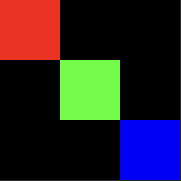

# Portable Pixmap (PPM) Module - Fortran
Simple and easy-to-use module to create and modify ppm images.

## Features
- `point(x, y, color)` - Draws a point on the image.
- More coming soon...

## Basic Example
``` f90
program ppm_example
    use ppm

    call ppm_init(3, 3)

    call point(1, 1, color(255, 0, 0))
    call point(2, 2, color(0, 255, 0))
    call point(3, 3, color(0, 0, 255))

    call render_image(1, "output")

    call ppm_release()
end program
```

### Output (Upscaled): 


## Build

``` sh
# Just Compile PPM
gfortran -c ppm.f90

# Compile Project
gfortran -c [FileName].f90
gfortran -o [OutputFile].out [FileName].o ppm.o
```

## List of All Procedures

| Procedure | Description |
| :---      | :---        |
| `ppm_init(width, height)` | Initializes ppm module. |
| `ppm_release()` | Releases all resources that ppm uses. |
| `render_image(unit, file_name)` | Renders the image for the given unit and filename. |
| `color(r, g, b)` | Returns a color. |
| `point(x, y, color)` | Draws a point on the image. |